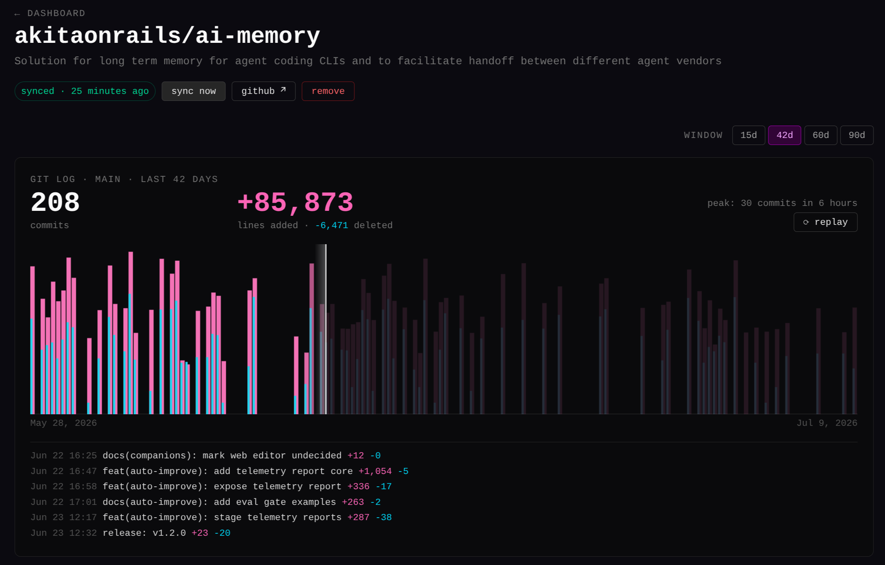
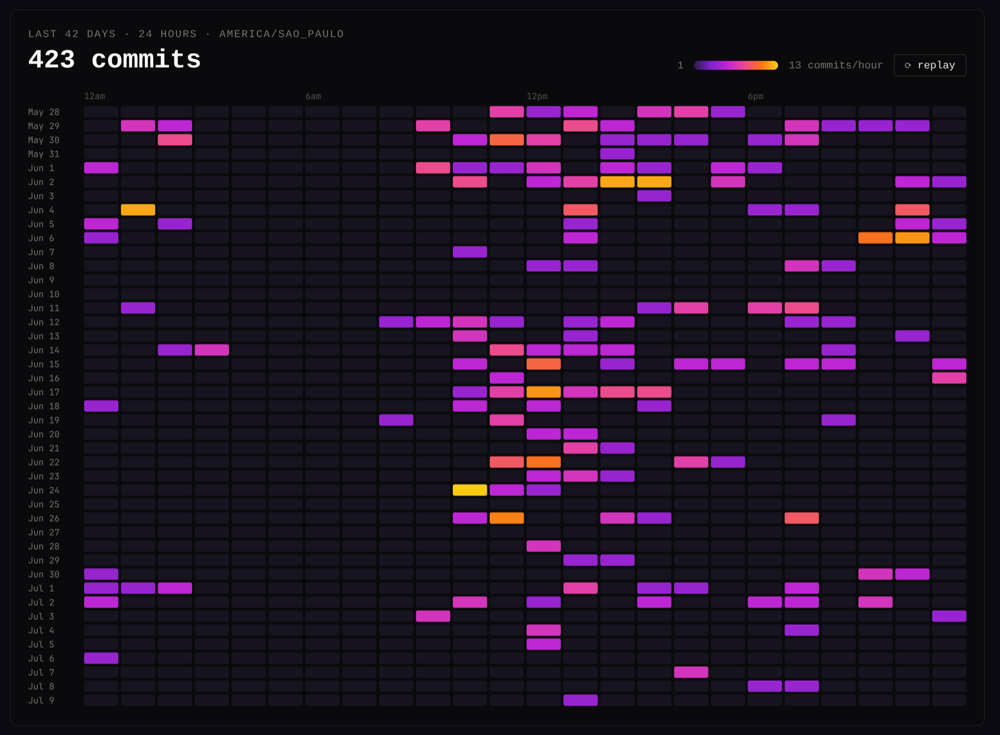
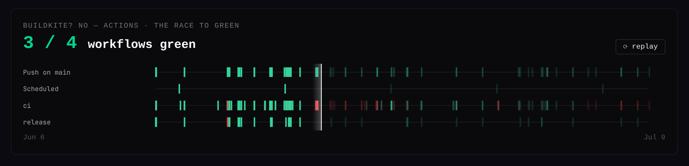
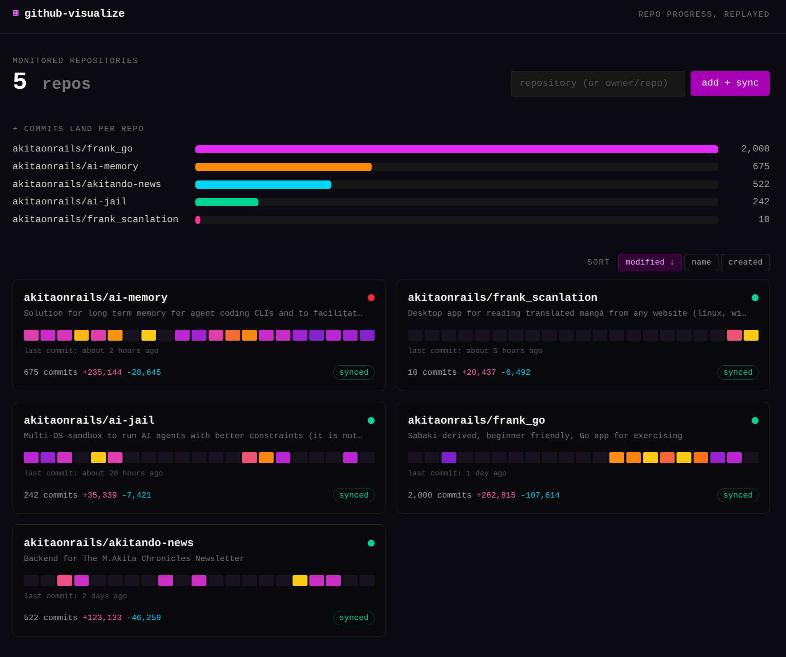

# github-visualize

Self-hosted dashboard that monitors your GitHub repositories and replays their
progress with animated visualizations, inspired by the charts embedded in
Bun's ["How we made Bun's TypeScript 100x faster by rewriting it in Rust"](https://bun.com/blog/bun-in-rust)
blog post.

For each monitored repository you get:

- **Commit timeline replay** — lines added (pink) and deleted (cyan) per time
  bucket (log scale), with animated counters and a scrolling `git log` feed
  revealed by a sweeping scan bar.

  

- **Day-by-hour heatmap** — commits per hour on a purple-to-yellow heat ramp,
  cells fading in chronologically with the commit counter climbing in sync.

  

- **The race to green** — one lane per GitHub Actions workflow, one tick per
  run, dim ticks lighting up green/red as the scan bar passes.

  

- **Dashboard overview** — commits-per-repo bars, sortable repo cards with
  daily activity chips, live sync status, and latest CI state; new repos are
  added in place with typeahead autocomplete.

  

Charts replay when scrolled into view over a selectable window (15/42/60/90
days), and every chart has a ⟳ replay button. Animations respect
`prefers-reduced-motion`.

## Stack

Rails 8.1 (slim: no mailer/storage/cable/action-text), SQLite, Solid Queue
(background sync, no Redis), Tailwind CSS 4, importmap + Stimulus with
hand-rolled canvas charts. No authentication in v1 — deploy it on a trusted
network only.

Data is fetched with the **minimum possible API calls**: commit history comes
from the GitHub GraphQL API (which returns additions/deletions in bulk, 100
commits per request) and workflow runs from the REST API. Syncs are
incremental and idempotent (`upsert_all`), and run every 30 minutes in
production (`config/recurring.yml`).

## Configuration

All secrets come from the environment — nothing sensitive is committed.
Copy `.env.example` to `.env` (gitignored) and fill in:

| Variable | Required | Purpose |
|---|---|---|
| `GITHUB_TOKEN` | yes | Token with read access to the repos (fine-grained: Contents + Actions read) |
| `SECRET_KEY_BASE` | production | `openssl rand -hex 64` |
| `PORT` | no | Host port for Docker (default 7592) |
| `APP_TIME_ZONE` | no | Timezone used to bucket charts (default UTC; compose sets America/Sao_Paulo) |
| `STORAGE_PATH` | no | Host dir for the SQLite volume (default `./storage`) |

## Development

```bash
bin/setup            # bundle + db:prepare
bin/dev              # server + tailwind watcher on :3000
bin/rails test       # test suite, SimpleCov report in coverage/
bin/rubocop          # omakase style
bin/brakeman         # static security analysis
bin/bundler-audit    # known-vulnerable gems
bin/importmap audit  # JS dependency advisories
```

Add a repository from the dashboard form (`owner/name`) — the first sync is
enqueued automatically. To sync from the console:

```ruby
repo = Repository.create!(owner: "akitaonrails", name: "ai-memory")
SyncRepositoryJob.perform_now(repo)
```

In development, run queued jobs with `bin/jobs` (or inline via the console as above).

## Quick start — run from the public Docker image

The image is published as
[`akitaonrails/github-visualize`](https://hub.docker.com/r/akitaonrails/github-visualize)
(single container: Thruster + Puma with the Solid Queue job supervisor
in-process; SQLite persisted in a volume — no external database or Redis).

Fastest possible try-out:

```bash
docker run -d --name github-visualize -p 7592:80 \
  -e SECRET_KEY_BASE="$(openssl rand -hex 64)" \
  -e GITHUB_TOKEN="ghp_your_token" \
  -e GITHUB_OWNER="your-github-username" \
  -e SOLID_QUEUE_IN_PUMA=1 \
  -v ./storage:/rails/storage \
  akitaonrails/github-visualize:latest
# http://localhost:7592
```

### Self-hosted server with docker compose

Create a directory on your server with a `.env` file (never commit it):

```bash
mkdir -p github-visualize/storage && cd github-visualize
cat > .env <<EOF
SECRET_KEY_BASE=$(openssl rand -hex 64)
GITHUB_TOKEN=ghp_your_token
EOF
chmod 600 .env
```

And a `docker-compose.yml`:

```yaml
services:
  github-visualize:
    image: akitaonrails/github-visualize:latest
    container_name: github-visualize
    restart: unless-stopped
    user: "1000:1000"            # the image's non-root user
    ports:
      - "7592:80"
    volumes:
      - ./storage:/rails/storage # SQLite databases live here
    env_file: .env
    environment:
      - SOLID_QUEUE_IN_PUMA=1                  # background sync inside Puma
      - GITHUB_OWNER=your-github-username     # bare names in the add form
      - APP_TIME_ZONE=America/Sao_Paulo       # chart day/hour bucketing
    healthcheck:
      test: ["CMD", "curl", "-f", "http://localhost:80/up"]
      interval: 30s
      timeout: 10s
      retries: 3
      start_period: 40s
```

Then:

```bash
chown -R 1000:1000 storage   # container runs as uid 1000
docker compose up -d
```

Notes for self-hosters:

- `GITHUB_TOKEN` needs read access to the repos you want to monitor; a
  fine-grained token with **Contents: read** and **Actions: read** is enough.
  Private repos work as long as the token can read them.
- On SELinux hosts (Fedora/openSUSE MicroOS), do **not** add `:Z` to the bind
  mount — it breaks SQLite. Add `security_opt: ["label:disable"]` instead.
- There is no user authentication in v1 — keep it on a trusted network (LAN,
  VPN, or behind an authenticating proxy/tunnel). For anything more exposed,
  two opt-in mitigations are built in:
  - `HTTP_BASIC_USER` + `HTTP_BASIC_PASSWORD` — enables HTTP Basic auth on
    every page (the `/up` health check stays open).
  - `ALLOWED_HOSTS=192.168.0.90,gv.example.com` — Host-header allowlist,
    mitigating DNS-rebinding attacks against a no-auth LAN service.
- Databases are migrated automatically on boot; repos re-sync every 30 minutes.

### Deploying your own server with bin/deploy

One-command SSH deploy for anyone hacking on this repo:

```bash
DEPLOY_HOST=user@your-server bin/deploy
```

Configuration via env vars — or a gitignored `.deploy.env` in the repo root
so you never retype them:

| Variable | Default | Purpose |
|---|---|---|
| `DEPLOY_HOST` | *(required)* | SSH target |
| `DEPLOY_IMAGE` | `akitaonrails/github-visualize:latest` | set to your registry account for forks (`docker login` required) |
| `DEPLOY_DIR` | `/var/opt/docker/github-visualize` | stack dir on the server |
| `DEPLOY_PORT` | `7592` | host port |
| `SKIP_CHECKS=1` | — | skip tests + lint |

The script builds and pushes the image, pulls it on the server, installs
`deploy/docker-compose.yml`, seeds the server's `.env` on the **first** deploy
only (generated `SECRET_KEY_BASE`; `GITHUB_TOKEN`, `GITHUB_OWNER`,
`APP_TIME_ZONE`, `PORT` taken from your local environment) and waits for
`/up`. Only this stack's container is (re)created — other stacks on the
server are untouched. Secrets never enter the git repository.

Notes: the bind mount must **not** use `:Z` on SELinux hosts — the compose
file sets `security_opt: label:disable` instead; the container runs as
uid 1000 (`rails`) and `bin/deploy` chowns `storage/` accordingly.

## CI

GitHub Actions (`.github/workflows/ci.yml`): Brakeman, bundler-audit,
importmap audit, RuboCop (cached), and the test suite with a coverage
artifact.
